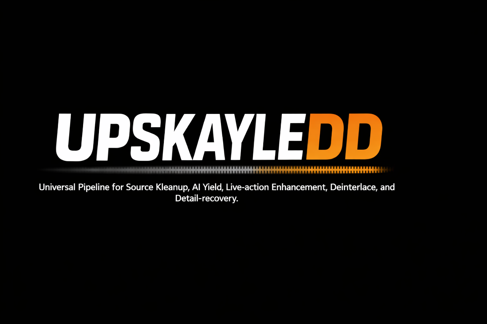
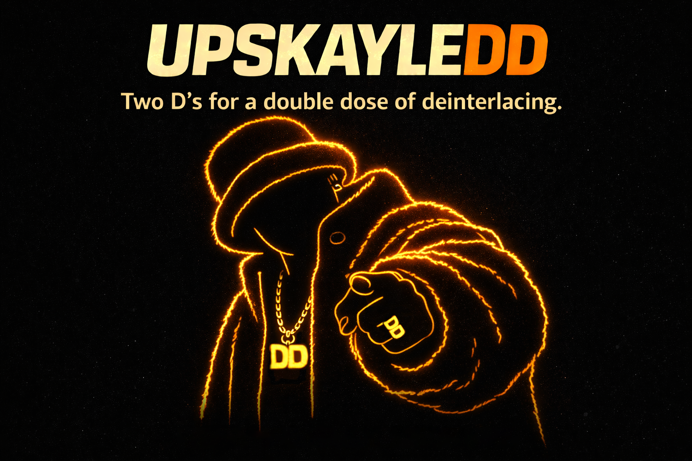

# UPSKAYLEDD

**Two D's for a double dose of deinterlacing.**

UPSKAYLEDD is an open-source desktop app and CLI for inspecting, restoring, previewing, and batch-upscaling legacy video with a reproducible pipeline. It is designed to make serious restoration workflows approachable without pretending to be a magic remaster button.

## What it is

UPSKAYLEDD is a restoration orchestrator, not a magical one-click hallucination box.

The baseline product flow is:

1. Drop in files or folders
2. Inspect streams, cadence, geometry, and likely source traits
3. Present a plain-English analysis summary and a recommended pipeline
4. Preview stage-specific before/after results
5. Accept sensible defaults or override selected stages
6. Run resumable jobs
7. Review outputs, manifests, logs, and preview artifacts

## Product stance

UPSKAYLEDD is built around a few simple rules:

- be conservative by default
- let stronger cleanup/upscale paths exist, but make users opt into them intentionally
- fix structural issues before cleanup and upscale
- optimize for truthful previews, not flashy promises
- keep the first-run path simple and the advanced path one layer deeper
- keep GUI and CLI on the same engine
- prefer explicit warnings and fallbacks over silent degradation

## Current status

UPSKAYLEDD is actively under construction, but it already has a real MVP-shaped vertical slice:

- a shared `AppService` boundary used by both desktop and CLI
- a selected **PySide6** desktop shell
- ingest, analysis summary, workspace, queue bar, and dashboard/result review screens
- source-aware stage selection
- preview caching plus exact/approximate preview surfacing
- restart-safe, resumable queue execution
- manifests, logs, and artifact writing
- automated tests covering service and desktop flow behavior
- a Windows-first portable build plus a simple Windows installer build path

This is not production-ready yet, but it is no longer just a bit.

## Canonical stack

The project is built around:

- **Python** for orchestration and engine code
- **PySide6** for the desktop shell
- **VapourSynth** for restoration graph assembly
- **vs-mlrt** for ML runtime and backend bridging
- **FFmpeg / ffprobe** for inspection, encode, mux, and packaging
- **SQLite + JSON artifacts** for resumability, manifests, and portable job data

The project should not drift into an FFmpeg-only design that weakens the restoration pipeline model.

## Target users

The first target user is a technically comfortable desktop user with legacy TV/DVD-era material who wants cleaner, natural-looking 1080-class or higher outputs without hand-building a VapourSynth + FFmpeg workflow.

The motivating source class is:

- SD live-action NTSC/PAL DVD-era content

But the architecture is intended to leave room for:

- SD animation / anime
- progressive HD cleanup
- analog / noisy capture repair
- archive and film-like content

## Product goals

- Windows-first shipping and validation
- Linux considered from the start, not bolted on later
- NVIDIA accelerated where available, but not NVIDIA-locked
- stage-aware interactive previews before long renders
- resumable batch work that survives interruption
- reproducible manifests and readable logs
- hardware optimization as a backend choice, not the product identity

## Non-goals

UPSKAYLEDD should not overreach into:

- plugin marketplace design
- distributed rendering
- cloud processing
- interpolation-first workflows
- aggressive one-click “AI remaster” claims
- fake native 4K promises from busted SD sources

## Near-term priorities

- keep tightening desktop UX and preview controls
- beat on real ugly footage harder
- tune safer defaults for live action vs animation
- harden long-run queue, interruption, and resume behavior
- improve packaging and first-run setup on real target machines

## Contributing

Contributions are welcome, especially around:

- source analysis and detection
- restoration preset tuning
- preview and dashboard UX
- cross-platform packaging
- benchmarking and quality validation
- docs that make the tool less intimidating

Start with [CONTRIBUTING.md](CONTRIBUTING.md).

## Repo hygiene

Please do not commit:

- giant media files
- private sample clips
- model weights unless there is a very good reason
- generated outputs, previews, caches, or local runtime state

The repo should stay lean. Large media and weights should be fetched or staged outside normal source control.

## License

This repository is released under the **Apache License 2.0**. See [LICENSE](LICENSE).

## Name

Yes, the name is a joke.

Yes, the joke is staying.
